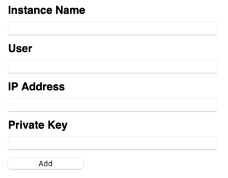
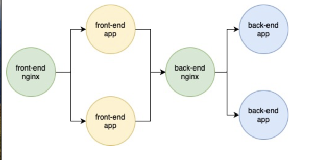

# BastionBook-3tierArch

* The frontend and backend code files will be in the **main** branch which you're already in.

* For the ansible playbook files switch to the **deploy** branch.

#### SETUP INSTRUCTIONS

* clone the repository

    `git pull https://github.com/VishakArudhra/BastionBook-3tierArch.git`

* cd into 'BastionBook-3tierArch'

    `cd BastionBook-3tierArch`

* make docker compose build the images and stand the containers up

    `docker compose up -d --build`

* once you're ready to tear down

    stop the containers initiated through docker compose

    ```
    docker compose down --volumes
    ```

    remove all containers (assuming you're in a VM stood up just to run your experimental containers)

    ```
    docker rm -f $(docker ps -a -q)
    ```

    remove all images (if you're in the same VM / environment)

    ```
    docker rmi $(docker images -a -q)
    ```

**A temporary note about the deploy branch**

Since the first commit pushed in attempts for the containerized deployment of our application in the **main** branch, the file structure has been changed significantly to affect the sucessful working of the **deploy** branch.

Therefore, until this inconsistency is fixed, those with limited knowledge might not find it easy to work the **deploy** branch and execute the *ansible playbooks*.

### The previous setup and the current setup

The obvious similarity between the previous setup and the current setup is both of them being implementations of the three tiered architecture namely the frontend, the backend and the database.

The differences are simply in how each tier is implemented in both the setups:

* **Frontend**

    In the previous setup, the frontend application would be setup as a service to run as a daemon which would be frontend with nginx as a reverse proxy all within a VM (like an EC2 instance). Visit the *deploy* branch to learn about the setup in detail.

    In the current setup, the basic elements at work in the previous setup, like nginx and the application, are just containerized. An **nginx** container this time functions more as a *load balancer* and distributes traffic to the target frontend application containers.

* **Backend**

    In the previous setup, the backend was just the `bastionbookBackend.py` file (with slight changes) deployed to an *AWS Lambda function* along with the dependency .zip files uploaded as [lambda layers](https://docs.aws.amazon.com/lambda/latest/dg/chapter-layers.html).

    The file referenced above is just a slightly modified verision of the original code given as an example in an [AWS userguide](https://docs.aws.amazon.com/lambda/latest/dg/services-apigateway-tutorial.html). The original version does not need *flask* to receive and process JSON requests as the lambda environment takes care of it all.

    In the current setup, however, flask is at the core of the application container's ability to function like an API endpoint for the frontend application.

* **Database**

    There was never an attempt to necessarily 'containerize' this layer as doing so would have been a risk of losing the benefits of ACID properties which is otherwise upheld normally in cloud services like *Aurora* and *DynamoDB* in AWS.


### The Backend Endpoint

* **previous setup**

    [This guide](https://docs.aws.amazon.com/lambda/latest/dg/services-apigateway-tutorial.html) was mostly the reference for setting up the backend endpoint for our application. 
    
    
    
    
    Giving it a read is sincerely recommended to know the exact setup details. Changes made to suite our use case were simple such as setting the DynamoDB table partition key as `inst_name` and similarly, the other keys according to the required user inputs in the application page.

    

    #### Setting a custom domain name for the API Gateway Endpoint.

    An API Gateway is *an additional* software layer setup to mediate and regulate the incoming requests for purposes of authentication, authorization and security. Nonethless, it's encouraged to check the internet for more accurate explanations.

    With that said, as much as it's easy to stand up an API Gateway on cloud platforms like AWS, there's also the trouble of relying on a single randomly generated endpoint url. For .e.g.,

    `https://25a34it921.execute-api.us-east-2.amazonaws.com/test`

    However, in an event wherein the API Gateway is destroyed and the endpoint url becomes defunct, the image may have to be rebuilt several times with the application files having the newer endpoint url.

    So, to save the trouble of repeatedly undergoing such a gruelling process, a more 'static' and constant endpoint based on a familiar domain address can be a solution.

    [Here's](https://wenheqi.medium.com/route-api-gateway-api-to-a-custom-domain-name-using-route53-251bc7f6fe75) the reference article used to implement this.
    
    #### Buying a domain and setting up Route53 Hosted Zones

    The first step in creating a custom domain endpoint to replace your randomly generated, default endpoint is to buy a domain name that suites the identity of your application overall. 
    
    Thereon, the 'name server' addresses of whichever hosted zone the requests should go to, should be be added in the DNS portal. All the steps including these to setup a **custom domain name** are detailed in the reference article linked above.
    
    An important point to keep in mind while associating multiple Route53 hosted zones with your domain is to be careful about the name given to each hosted zone resource created.

    Giving the same address to all the associated Route53 Hosted zones can obstruct the normal routing of requests to any one particular Route53 hosted zone and importantly, therefore, to any one particular cloud resource.

    For e.g.,

    If `vishakarudhra.com` is the domain bought. In case of having multiple hosted-zones, just name each of them after a different subdomain address for e.g.,

    ```
    api1.vishakarudhra.com
    api2.vishakarudhra.com
    api3.vishakarudhra.com
    ``` 

    Conveniently, it's also possible host different API Gateway endpoints in different subdomains named after their corresponding stage for e.g.,

    ```
    test.vishakarudhra.com
    prod.vishakarudhra.com  (and so on..)
    ```

    Refer to [this](https://docs.aws.amazon.com/apigateway/latest/developerguide/how-to-custom-domains.html) AWS userguide for exact and more accurate knowledge of the setup procedure.

    #### Testing your API Endpoint

    Once, the *custom domain* endpoint was ready, before including it into the frontend application, it's wise to test the request resolution to it through commands like `dig` and `nslookup`.

    If everything looks normal, it's good to proceed to checking whether the API respods appropriately to the inputs with the kind of json payload that it's supposed to respond appropriately too. For e.g., here's a curl command I used to test my API endpoint.

    ``` bash
    curl -X POST 
         -H "Content-Type: application/json"
         -d '{"payload":"hello world!"}' api.example.com/test/dynamodb 
    ```

    This should return some kind of json object indicating the success of the operation. 

### Current Setup

* **Establishing container-to-container communication**

    In both the current and the previous setups, communication across the layers happens through public or private DNS resolution.

    While in the previous setup, the frontend and backend were hosted in separate, physically isolated cloud resources like a VM and a lambda function respectively, the same run in their own sets of containers each, in the current setup. The question that arises then is, 
    
    *how is a frontend container going to reach to a backend container?*

    1) As already mentioned earlier, the frontend and the backend containers are both going to run behind their own specific *nginx* containers.

        
    

        So, the frontend application will have to reach backend application through its corresponding nginx container.
    
    2) All containers instantiated and run through *docker compose* are part of the same network (created again by docker compose) where each container is aware of the *[network aliases](https://docs.docker.com/engine/reference/commandline/network_connect/#alias)* of the rest.

        To understand the function of network aliases in a 'multi-container' setup, it's recommended to read this [walkthrough](https://docs.docker.com/get-started/07_multi_container/).

        You can test the resolution of other containers in the network by simply cURL'ing to a container's network alias in this manner, for e.g., 

        `curl -X POST 
         -H "Content-Type: application/json"
         -d '{"payload":"hello world!"}' http://backend-endpoint/`

         As in the above example command, 'backend-endpoint' is the network alias given to the *backend - nginx* container and the same alias name is used in the frontend `.py` file to reach the backend.

* **Finally, If the database is an AWS DynamoDB table, how is the backend application supposed to have the access to it?**

    1) Create an IAM user with "just enough" permissions to work with the DynamoDB table specific to your application. Here are the policies I used:

        [Here's](https://docs.aws.amazon.com/IAM/latest/UserGuide/reference_policies_examples_dynamodb_specific-table.html) the reference.

        ``` json
            {
            "Version": "2012-10-17",
            "Statement": [
                {
                    "Sid": "ListAndDescribe",
                    "Effect": "Allow",
                    "Action": [
                        "dynamodb:List*",
                        "dynamodb:DescribeReservedCapacity*",
                        "dynamodb:DescribeLimits",
                        "dynamodb:DescribeTimeToLive"
                    ],
                    "Resource": "*"
                },
                {
                    "Sid": "SpecificTable",
                    "Effect": "Allow",
                    "Action": [
                        "dynamodb:BatchGet*",
                        "dynamodb:DescribeStream",
                        "dynamodb:DescribeTable",
                        "dynamodb:Get*",
                        "dynamodb:Query",
                        "dynamodb:Scan",
                        "dynamodb:BatchWrite*",
                        "dynamodb:CreateTable",
                        "dynamodb:Delete*",
                        "dynamodb:Update*",
                        "dynamodb:PutItem"
                    ],
                    "Resource": "arn:aws:dynamodb:*:*:table/yourTableName"
                }
            ]
        }
        ```
    
    2) Note the user access and secret keys and note how they've been put to a specific format in the files `config` and `credentials` in the directory `bastionbook-backend`.

    3) Inject them into the directory in your container where your aws credentials lie, through volume-mapping.

        ```yaml
        volumes:
        - ./bastionbook-backend/.aws:/home/bas10book/.aws
        
        ```

         With this, it's strongly recommended to observe how AWS credentials and default profile files can be mounted into to a container directory through a volume in the `compose.yaml` file.

    4) Test access to your resources with these simple commands

        Enter a backend application container:

        ``` bash
        docker exec -it <container-id> /bin/bash
        ```

        Check access to your AWS account

        ``` bash
        aws sts get-caller-identity
        ```
    
    ***Btw, volume mapping is the same way it was possible to create two nginx containers from the same dockerfile but with each pointed towards containers of either the frontend layer or the backend.*** 
    
    So, it's recommended to study the `compose.yaml` file to observe how each nginx container initiated by the file has been configured.

    [This](https://www.freecodecamp.org/news/the-nginx-handbook/#variables-in-nginx) tutorial-article was very useful in picking up and getting familiar with a lot of nginx vocabulary.

#### Reference used to write the *frontend* and *nginx* docker files:

https://www.geeksforgeeks.org/load-balancing-flask-application-using-nginx-and-docker/

https://github.com/docker/awesome-compose/blob/master/nginx-wsgi-flask/README.md
    


    


